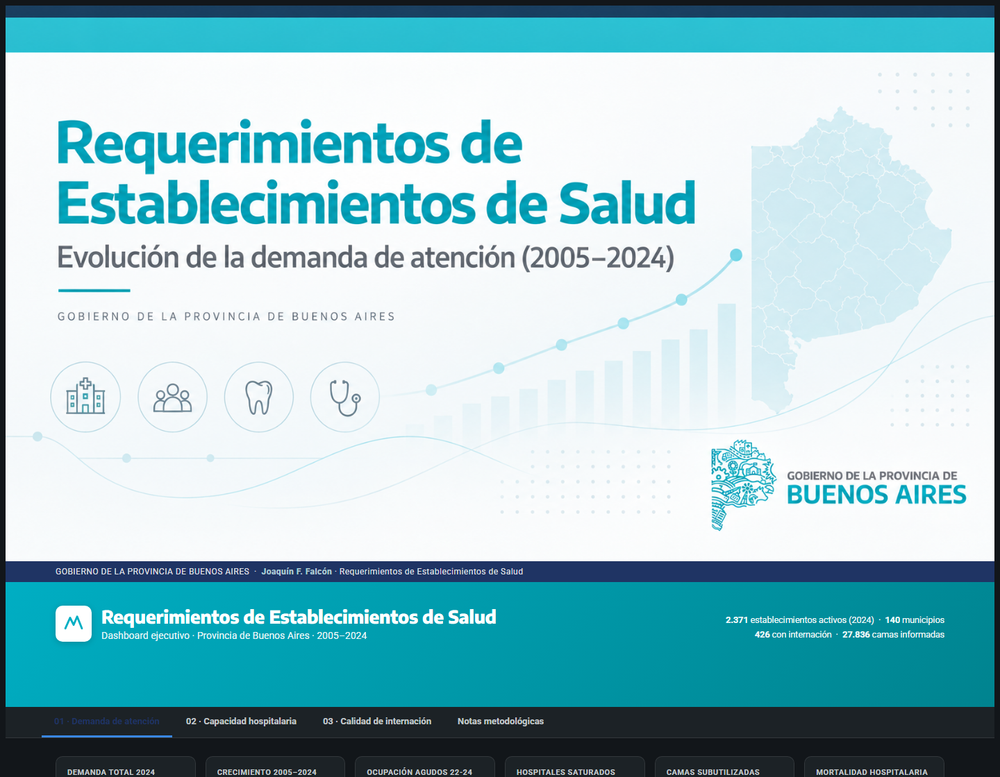

# Healthcare Analytics — Rendimientos de establecimientos de salud de Buenos Aires

`Power BI · SQL · DAX · Power Query · PBIP/TMDL · Data Quality · Healthcare Analytics`

Proyecto end-to-end de análisis de datos sanitarios orientado a estudiar demanda,
capacidad instalada y rendimiento hospitalario en establecimientos públicos de la
Provincia de Buenos Aires, 2005–2024 (43.725 filas). Incluye modelo semántico de
Power BI, dashboard nativo de tres páginas, una vista HTML standalone del mismo
modelo, y una auditoría de calidad de datos documentada.



**[→ View Live Dashboard](https://joacofalcon58.github.io/requerimientos-salud-pba/)** · **[→ Explore Source Code](dashboard/)**

---

## Business Questions

1. ¿Cómo evolucionaron la demanda y la actividad asistencial entre 2005 y 2024, y qué municipios o regiones concentraron el crecimiento?
2. ¿Qué establecimientos presentan señales de saturación o subutilización de capacidad hospitalaria?
3. ¿Qué establecimientos presentan valores atípicos de estadía o mortalidad respecto de establecimientos comparables (misma dependencia: Municipal, Provincial o Nacional)?

Los indicadores de las preguntas 2 y 3 son descriptivos —basados en umbrales
definidos en este tablero— y no constituyen una evaluación clínica integral ni un
ajuste por riesgo.

## Key Insights

- **Demanda total (2005→2024):** de 50,5 M a 121,8 M prestaciones anuales
  (+141,4%, CAGR 4,7%/año), con una caída de -21% en 2020 asociada a la pandemia.
- **Concentración geográfica del crecimiento:** las regiones sanitarias V y VI
  explican el 58% del aumento provincial (geografía constante 2024, para no
  mezclar reasignaciones administrativas con crecimiento real).
- **Capacidad hospitalaria (agudos, 2022–2024):** de 278 establecimientos
  analizados, 20 están saturados (90–100% ocupación agregada, 1.807 camas) y 50
  subutilizados (≤40% ocupación, 1.977 camas); 25 establecimientos adicionales
  muestran inconsistencias en los datos informados (ocupación >100%) y quedan
  excluidos de estas conclusiones hasta validarse.
- **Desempeño relativo:** 90 establecimientos superan 1,6x la estadía o 2,0x la
  mortalidad de la mediana de su misma dependencia.
- **Calidad de datos como parte del análisis, no una nota al pie:** durante la
  auditoría se detectó que un mismo nombre de establecimiento correspondía a dos
  identidades distintas en la base (`establecimiento_id` no es persistente antes
  de 2018), lo que invalidaba una serie temporal hasta separarlas. El detalle
  completo de este y otros hallazgos está en [`docs/data-quality.md`](docs/data-quality.md).

## Architecture

```text
Buenos Aires Open Data (rendimientos hospitalarios, CSV)
               ↓
          SQL Server (staging + tablas finales)
               ↓
       Power BI Semantic Model (TMDL, relaciones, columnas calculadas)
               ↓
          Medidas DAX (razón de sumas, no promedio de porcentajes)
               ↓
         Power BI Report (3 páginas)
               ↓
       Vista HTML standalone (mismo modelo, sin dependencias de Power BI)
```

## Tech Stack

| Layer | Technology |
|---|---|
| Data Source | CSV / datos públicos de rendimientos hospitalarios (PBA) |
| Database | SQL Server |
| Transformation | SQL (staging) / Power Query |
| Semantic Model | Power BI · PBIP/TMDL |
| Analytics | DAX |
| Visualization | Power BI Report + HTML/CSS/JS (Chart.js) standalone |
| Version Control | Git / GitHub |
| Deployment | GitHub Pages |

## Skills Demonstrated

- Data cleaning and normalization
- SQL staging and transformation
- Dimensional modeling
- DAX development
- Power BI report development
- PBIP / TMDL version control
- Data-quality auditing
- KPI design
- Healthcare analytics
- Analytical storytelling

## Data Quality & Limitations

La auditoría de comparabilidad identificó y corrigió: geografía no constante en
las comparaciones regionales, cohortes inconsistentes entre tarjeta/gráfico/tabla
en la página de desempeño relativo, y una tarjeta de ocupación que mezclaba
universos distintos al resto de la página. Sigue pendiente de validar: 372 códigos
de establecimiento con más de un nombre asociado durante 2022–24 (posibles
reasignaciones administrativas, no necesariamente errores). Los umbrales de
saturación, subutilización, estadía y mortalidad son reglas descriptivas de este
tablero, no estándares clínicos externos.

Detalle completo, con evidencia reproducible: [`docs/data-quality.md`](docs/data-quality.md).

## Repository Structure

```text
dashboard/      Power BI project (.pbip), Report y Semantic Model (TMDL)
sql/            Scripts SQL de creación y staging
data/           Datasets crudos (CSV) y notas de origen/licencia
docs/           Metodología, calidad de datos, definiciones y evidencia
screenshots/    Capturas del dashboard
index.html      Vista HTML standalone (GitHub Pages)
```

## Reproducing the Project

1. Obtener los CSV de origen (o usar los de [`data/raw/`](data/raw/)).
2. Ejecutar los scripts de [`sql/`](sql/) en orden (01 a 08); el paso 05 y 07
   requieren editar el path de `BULK INSERT` para que apunte a tu copia local de
   los CSV — ver [`data/README.md`](data/README.md).
3. Abrir `dashboard/Requerimientos de establecimientos de Salud.pbip` en Power BI Desktop.
4. Configurar la conexión al SQL Server local con tus propias credenciales.
5. Actualizar el modelo (Refresh).
6. Abrir el reporte — o directamente `index.html` para la vista standalone, que no requiere Power BI.

No se documentan credenciales ni rutas personales del entorno original.

## License

El código propio de este repositorio (SQL, DAX, definición del modelo y reporte
de Power BI, HTML/CSS/JS) está bajo licencia MIT — ver [`LICENSE`](LICENSE).

El dataset de origen (`data/raw/`, `docs/evidence/`) es un dato público de
terceros (Gobierno de la Provincia de Buenos Aires) y no está cubierto por esta
licencia. `docs/definitions/Anexo III.pdf` es el manual de marca oficial de la
Provincia, incluido solo como referencia de diseño.

---

AI-assisted development was used for selected documentation, QA and development
workflows. All analytical logic, results and final implementation were reviewed
and validated manually.
