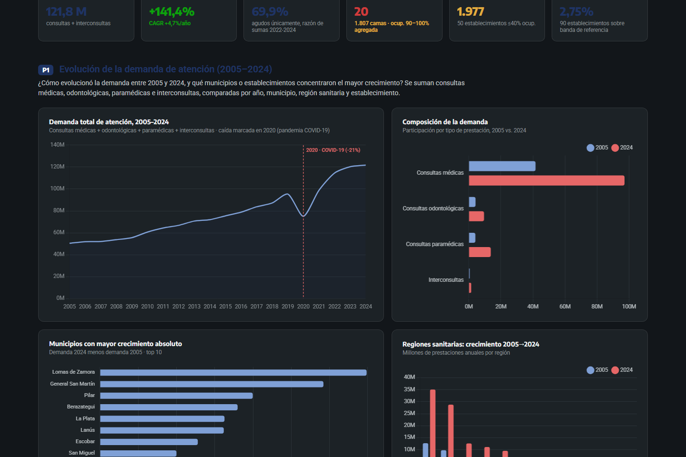
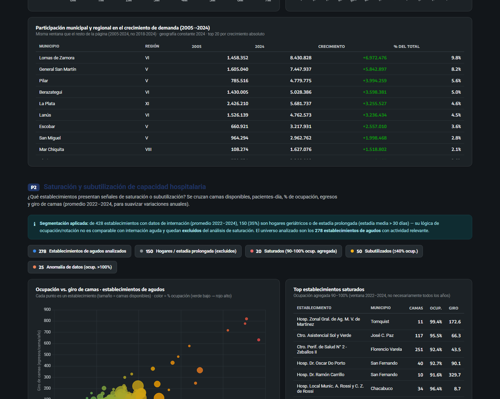
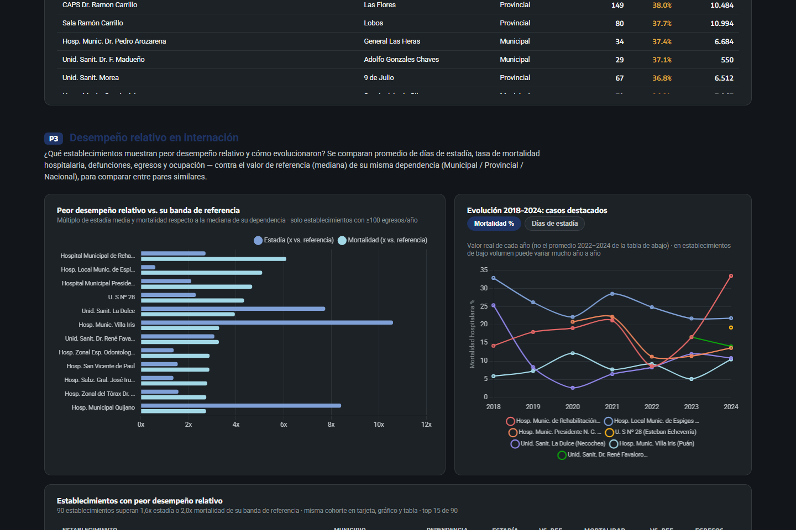

# Requerimientos de Establecimientos de Salud — PBA

Dashboard ejecutivo sobre la demanda de atención, la capacidad hospitalaria y el desempeño de internación de los establecimientos de salud de la Provincia de Buenos Aires, 2005–2024.

**🔗 Ver el dashboard en vivo:** **[joacofalcon58.github.io/requerimientos-salud-pba](https://joacofalcon58.github.io/requerimientos-salud-pba/)**

Construido en Power BI a partir de datos oficiales de rendimientos hospitalarios (43.725 filas, 2005–2024), y publicado también como una página HTML standalone que reproduce el mismo modelo de datos 1:1 — pensada para compartirse sin necesitar Power BI instalado.

---

## Capturas

### Portada

### P1 · Evolución de la demanda de atención (2005–2024)

### P2 · Saturación y subutilización de capacidad hospitalaria

### P3 · Desempeño relativo en internación

---

## Las 3 preguntas del dashboard

**P1 — ¿Cómo evolucionó la demanda y quién concentró el crecimiento?**
La demanda total (consultas médicas + odontológicas + paramédicas + interconsultas) pasó de 50,5 M a 121,8 M prestaciones anuales: **+141,4%, CAGR 4,7%/año**, con una caída de -21% en 2020 por la pandemia. Las regiones V y VI concentran el 58% del crecimiento provincial; Lomas de Zamora, General San Martín y Pilar son los tres municipios de mayor aporte absoluto.

**P2 — ¿Qué establecimientos muestran señales de saturación o subutilización?**
Sobre 278 establecimientos de agudos (2022–24): **20 saturados** (90–100% ocupación, 1.807 camas) y **50 subutilizados** (≤40% ocupación, 1.977 camas). Otros 25 establecimientos presentan inconsistencias en los datos informados (ocupación >100%) y quedan excluidos de cualquier conclusión hasta auditarse.

**P3 — ¿Qué establecimientos tienen peor desempeño relativo (estadía/mortalidad)?**
**90 establecimientos** superan 1,6x la estadía o 2,0x la mortalidad de la mediana de su misma dependencia (Municipal / Provincial / Nacional). El caso más crítico es el Hosp. de Rehabilitación Dr. A. Drozdowski (Malvinas Argentinas), con mortalidad 6,1x la mediana municipal.

El HTML incluye un **globo de preguntas rápidas** (esquina inferior derecha) con estas tres respuestas más una cuarta sobre las limitaciones de los datos, para consulta inmediata sin tener que leer todo el tablero.

---

## Qué hay en este repo

| Carpeta / archivo | Contenido |
|---|---|
| `index.html` | Dashboard standalone (HTML + CSS + JS, sin dependencias salvo Chart.js por CDN) — mismo dato que el modelo de Power BI, verificado número por número |
| `Requerimientos de establecimientos de Salud.pbip` + `.Report/` + `.SemanticModel/` | Proyecto Power BI completo (formato PBIP/TMDL) |
| `Definiciones/` | Manual de marca, definiciones de rendimientos hospitalarios, tema visual de Power BI |
| `Consultas SQL/` | Scripts de creación y staging de la base `GBA_Rendimientos` |
| `Rendimientos de establecimientos de salud/` | Datos crudos (CSV) 2005–2023 y 2024 |
| `auditoria.md` | Auditoría de comparabilidad: identidad de establecimientos, geografía constante, cohortes y umbrales — qué se corrigió y qué queda pendiente |
| `docs/` | Evidencia reproducible de las revisiones de datos (consultas DAX, extractos, notas) |
| `handoff_powerbi_dashboard.md` | Handoff técnico del armado del dashboard |

## Metodología y limitaciones

- Fuente: modelo semántico Power BI conectado en vivo a la base `GBA_Rendimientos`, reconciliado contra el HTML (COUNTROWS y sumas de control incluidas en `docs/`).
- % Ocupación y Giro de camas se calculan como razón de sumas (no promedio de porcentajes ya calculados) para evitar sesgo de Simpson al agregar.
- `establecimiento_id` no es persistente antes de 2018 y varios códigos fueron reasignados a instituciones distintas entre años — la identidad institucional debe validarse antes de publicar rankings con nombre propio. Ver `auditoria.md` para el detalle completo y las prioridades pendientes.
- Los umbrales de saturación, subutilización, estadía y mortalidad son reglas descriptivas de este tablero, no estándares clínicos externos validados.

## Autor

**Joaquín F. Falcón** — Gobierno de la Provincia de Buenos Aires.
